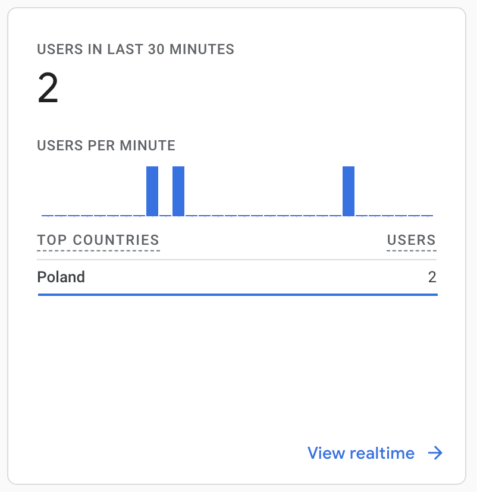
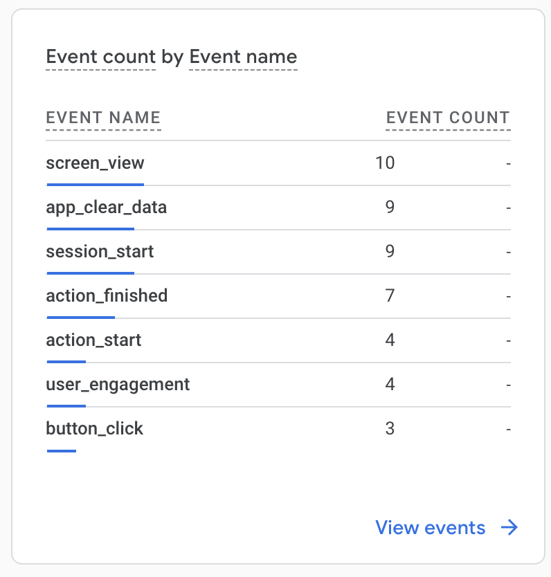
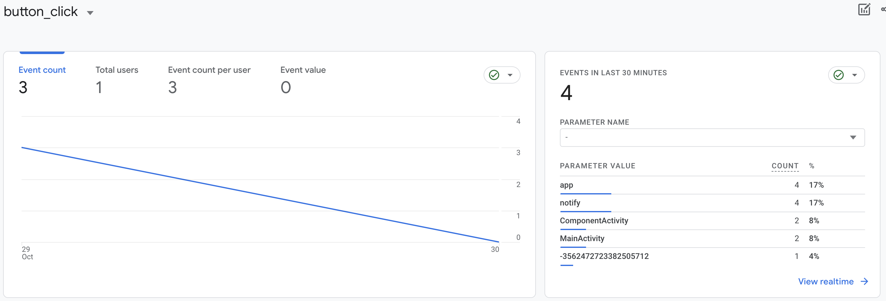

## 🧐 Firebase Analytics

Google Analytics helps you see how people use your Android app. It automatically tracks different
actions and user details. You can even create your own custom events to measure things that are
important to your app. Once it collects this info, you can check it out on a dashboard in the
Firebase console.

|                            Description                             |                               Picture                               |
|:------------------------------------------------------------------:|:-------------------------------------------------------------------:|
|                     Users in last 30 minutes.                      |        |
|              List of events from the selected period.              |       |
| When you click on an event, you can see more detailed information. |  |

### How to test?

First, you should add commands to terminal which allow you logging events.

```
adb shell setprop log.tag.FA VERBOSE
adb shell setprop log.tag.FA-SVC VERBOSE
adb logcat -v time -s FA FA-SVC
```

Last command will print logs for the device.
If you have problems with adb command, those links can
help: [Not found adb Error](https://dev.to/ravics09/solution-of-command-not-found-adb-error-29e7)
and [StackOverflow question](https://stackoverflow.com/questions/50456824/adb-command-not-found-on-mac-computer).
Then, you can open the app and start testing! You should be able to see relevant events in Logcat.

**❗️Be aware that you won't see analytics on dashboard immediately. Firebase needs about a few hours
to note it.❗️**

### Documentation

**Analytics Parameters**

| Event parameter name |  Type   |    Examples    |                           Description                           |
|:--------------------:|:-------:|:--------------:|:---------------------------------------------------------------:|
|         name         | String  | "button_click" | An important event in the application that you want to measure. |
|      item_name       | String  |    "notify"    |     Name of item that user interacted with during an event.     |
|       success        | Boolean |     `true`     |         Information whether the action was successful.          |

**Event Names**

|                     Event name                      | Parameters            | Description                                       |
|:---------------------------------------------------:|-----------------------|---------------------------------------------------|
|    [button_click](event_details/button_click.md)    | item_name             | Fired when a user clicked on a button or link.    |
|    [action_start](event_details/action_start.md)    | item_name             | Fired when we want to track start/finish actions. |
| [action_finished](event_details/action_finished.md) | item_name<br/>success | Called when the action_start is finished.         |
|   [simple_action](event_details/simple_action.md)   | item_name             | Fired when single actions is happening.           |
|   [screen_opened](event_details/screen_opened.md)   | item_name             | Called when screen is opened.                     |

**Screens**
* [Reviewers Screen](screens/reviewers_screen.md)
* [Pull Requests Screen](screens/pullrequests_screen.md)
* [Login Screen](screens/login_screen.md)
* [Authenticating](screens/authenticating.md)
