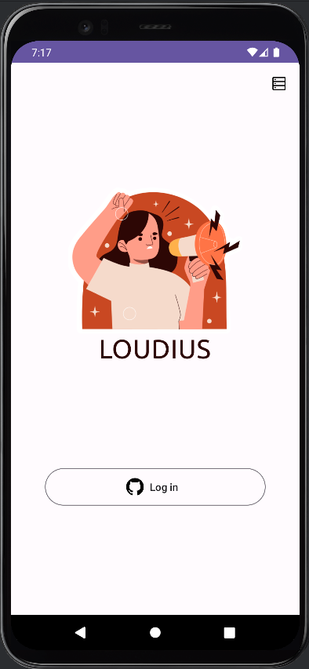
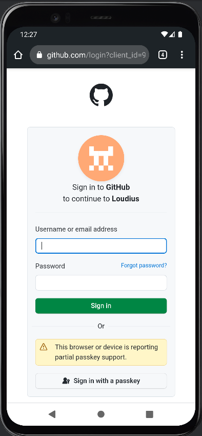
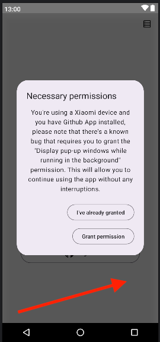
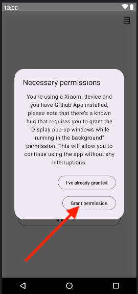
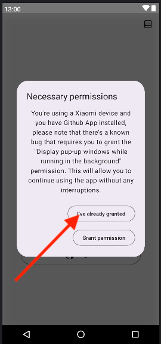

# Login Screen

## Documentation

|                         When login screen opened.                         | Specification                                                                              |
|:-------------------------------------------------------------------------:|--------------------------------------------------------------------------------------------|
|  | <pre>{    "name": "screen_opened"    "screen_name": "log_in_screen" }<pre/> |

|                         When user clicks log in.                          | Specification                                                                                                           |
|:-------------------------------------------------------------------------:|-------------------------------------------------------------------------------------------------------------------------|
|  | <pre>{    "name": "button_click"    "item_name": "log_in"    "screen_name": "log_in_screen" }<pre/> |

|                         When github auth opens.                          | Specification                                                                                                                      |
|:------------------------------------------------------------------------:|------------------------------------------------------------------------------------------------------------------------------------|
|  | <pre>{    "name": "simple_action"    "item_name": "open_github_auth"    "screen_name": "log_in_screen" }<pre/> |

|                         When user dismiss permission dialog.                         | Specification                                                                                                                                        |
|:------------------------------------------------------------------------------------:|------------------------------------------------------------------------------------------------------------------------------------------------------|
|  | <pre>{    "name": "simple_action"    "item_name": "xiaomi_permission_dialog_dismissed"    "screen_name": "log_in_screen" }<pre/> |

|                      When user clicks grant on permission dialog.                      | Specification                                                                                                                                                 |
|:--------------------------------------------------------------------------------------:|---------------------------------------------------------------------------------------------------------------------------------------------------------------|
|  | <pre>{    "name": "simple_action"    "item_name": "xiaomi_permission_dialog_permission_granted"    "screen_name": "log_in_screen" }<pre/> |

|                     When user clicks already granted on permission dialog.                     | Specification                                                                                                                                                         |
|:----------------------------------------------------------------------------------------------:|-----------------------------------------------------------------------------------------------------------------------------------------------------------------------|
|  | <pre>{    "name": "simple_action"    "item_name": "xiaomi_permission_dialog_permission_already_granted"    "screen_name": "log_in_screen" }<pre/> |
