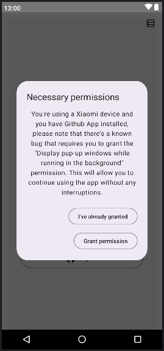

# Login Screen

## Documentation

|                         When user clicks log in.                          | Specification                                                                    |
|:-------------------------------------------------------------------------:|----------------------------------------------------------------------------------|
|  | <pre>{    "name": "button_click"    "item_name": "log_in" }<pre/> |

|              !!!!!When user clicks log in on xiaomi device.              | Specification                                                                               |
|:------------------------------------------------------------------------:|---------------------------------------------------------------------------------------------|
|  | <pre>{    "name": "simple_action"    "item_name": "open_github_auth" }<pre/> |

|                       When user clicks log in on xiaomi device.                       | Specification                                                                                            |
|:-------------------------------------------------------------------------------------:|----------------------------------------------------------------------------------------------------------|
|  | <pre>{    "name": "simple_action"    "item_name": "show_xiaomi_permission_dialog" }<pre/> |

|                         When user dismiss permission dialog.                         | Specification                                                                                                 |
|:------------------------------------------------------------------------------------:|---------------------------------------------------------------------------------------------------------------|
|  | <pre>{    "name": "simple_action"    "item_name": "xiaomi_permission_dialog_dismissed" }<pre/> |

|                      When user clicks grant on permission dialog.                      | Specification                                                                                                          |
|:--------------------------------------------------------------------------------------:|------------------------------------------------------------------------------------------------------------------------|
|  | <pre>{    "name": "simple_action"    "item_name": "xiaomi_permission_dialog_permission_granted" }<pre/> |

|                     When user clicks already granted on permission dialog.                     | Specification                                                                                                                  |
|:----------------------------------------------------------------------------------------------:|--------------------------------------------------------------------------------------------------------------------------------|
|  | <pre>{    "name": "simple_action"    "item_name": "xiaomi_permission_dialog_permission_already_granted" }<pre/> |
