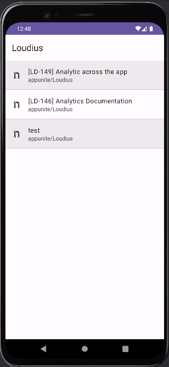
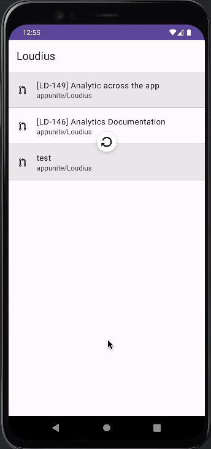
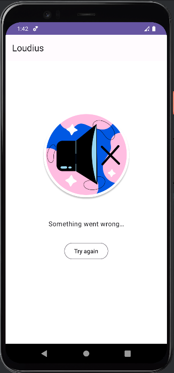
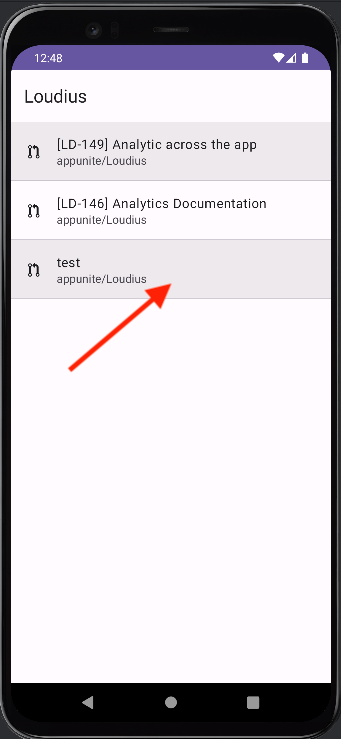

# Pull Requests Screen

## Documentation

|                           When pull requests screen opened.                            | Specification                                                                                   |
|:--------------------------------------------------------------------------------------:|-------------------------------------------------------------------------------------------------|
|  | <pre>{    "name": "screen_opened"    "item_name": "pull_requests_screen" }<pre/> |

|                           When user pulls to refresh.                            | Specification                                                                                        |
|:--------------------------------------------------------------------------------:|------------------------------------------------------------------------------------------------------|
|  | <pre>{    "name": "action_start"    "item_name": "refresh_pull_requests_data" }<pre/> |

|                         When refresh data finished with success.                         | Specification                                                                                                                   |
|:----------------------------------------------------------------------------------------:|---------------------------------------------------------------------------------------------------------------------------------|
|  | <pre>{    "name": "action_finished"    "item_name": "refresh_pull_requests_data"    "success": true }<pre/> |

|                         When refresh data finished with failure.                         | Specification                                                                                                                    |
|:----------------------------------------------------------------------------------------:|----------------------------------------------------------------------------------------------------------------------------------|
|  | <pre>{    "name": "action_finished"    "item_name": "refresh_pull_requests_data"    "success": false }<pre/> |

|                         When fetching data is started.                         | Specification                                                                                      |
|:------------------------------------------------------------------------------:|----------------------------------------------------------------------------------------------------|
|  | <pre>{    "name": "action_start"    "item_name": "fetch_pull_requests_data" }<pre/> |

|                         When fetch data finished with success.                         | Specification                                                                                                                 |
|:--------------------------------------------------------------------------------------:|-------------------------------------------------------------------------------------------------------------------------------|
|  | <pre>{    "name": "action_finished"    "item_name": "fetch_pull_requests_data"    "success": true }<pre/> |

|                         When fetch data finished with failure.                         | Specification                                                                                                                  |
|:--------------------------------------------------------------------------------------:|--------------------------------------------------------------------------------------------------------------------------------|
|  | <pre>{    "name": "action_finished"    "item_name": "fetch_pull_requests_data"    "success": false }<pre/> |

|                           When user clicks on pull request item.                           | Specification                                                                        |
|:------------------------------------------------------------------------------------------:|--------------------------------------------------------------------------------------|
|  | <pre>{    "name": "item_click"    "item_name": "pull_request" }<pre/> |
