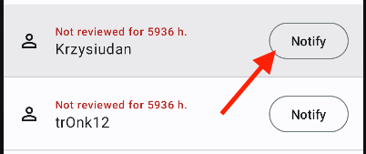
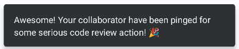
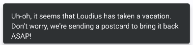
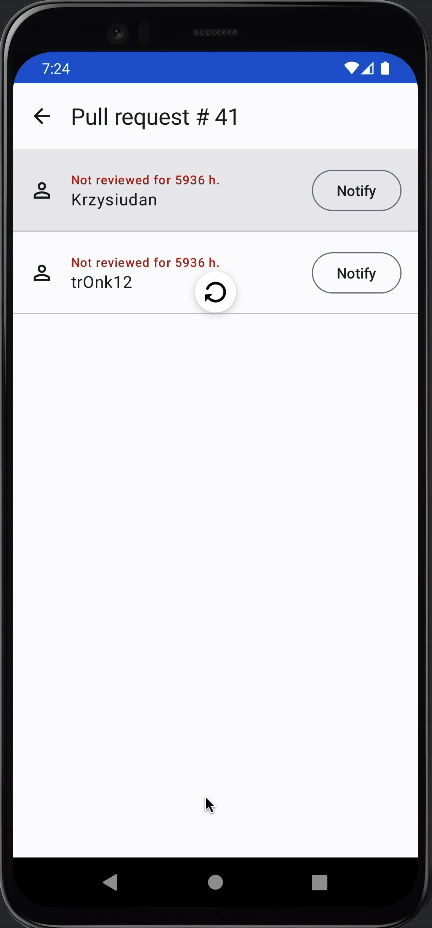
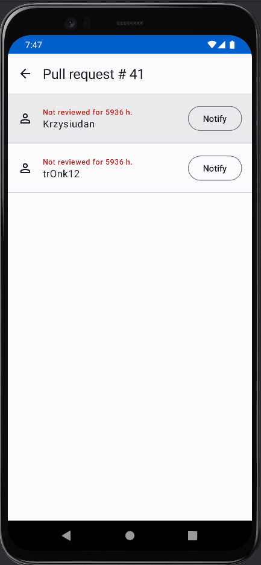
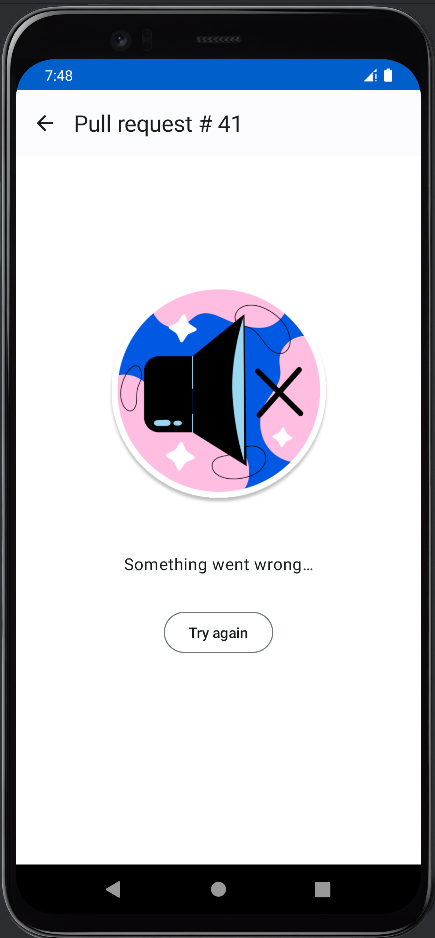

# Reviewers Screen

## Documentation

|                  When user clicks notify.                   | Specification                                                                    |
|:-----------------------------------------------------------:|----------------------------------------------------------------------------------|
|  | <pre>{    "name": "button_click"    "item_name": "notify" }<pre/> |

|     After user clicks notify, action finished with success.      | Specification                                                                                               |
|:----------------------------------------------------------------:|-------------------------------------------------------------------------------------------------------------|
|  | <pre>{    "name": "action_finished"    "item_name": "notify"    "success": true }<pre/> |

|    After user clicks notify, action finished with error.     | Specification                                                                                                |
|:------------------------------------------------------------:|--------------------------------------------------------------------------------------------------------------|
|  | <pre>{    "name": "action_finished"    "item_name": "notify"    "success": false }<pre/> |

|              When user pulls to refresh.               | Specification                                                                                    |
|:------------------------------------------------------:|--------------------------------------------------------------------------------------------------|
|  | <pre>{    "name": "action_start"    "item_name": "refresh_reviewers_data" }<pre/> |

|             When refresh data finished with success.              | Specification                                                                                                               |
|:-----------------------------------------------------------------:|-----------------------------------------------------------------------------------------------------------------------------|
|  | <pre>{    "name": "action_finished"    "item_name": "refresh_reviewers_data"    "success": true }<pre/> |

|            When refresh data finished with error.             | Specification                                                                                                                |
|:-------------------------------------------------------------:|------------------------------------------------------------------------------------------------------------------------------|
|  | <pre>{    "name": "action_finished"    "item_name": "refresh_reviewers_data"    "success": false }<pre/> |

|            When user opens reviewers screen.             | Specification                                                                                  |
|:--------------------------------------------------------:|------------------------------------------------------------------------------------------------|
|  | <pre>{    "name": "action_start"    "item_name": "fetch_reviewers_data" }<pre/> |

|            When fetch data finished with success.             | Specification                                                                                                             |
|:-------------------------------------------------------------:|---------------------------------------------------------------------------------------------------------------------------|
|  | <pre>{    "name": "action_finished"    "item_name": "fetch_reviewers_data"    "success": true }<pre/> |

|           When fetch data finished with error.            | Specification                                                                                                              |
|:---------------------------------------------------------:|----------------------------------------------------------------------------------------------------------------------------|
|  | <pre>{    "name": "action_finished"    "item_name": "fetch_reviewers_data"    "success": false }<pre/> |
